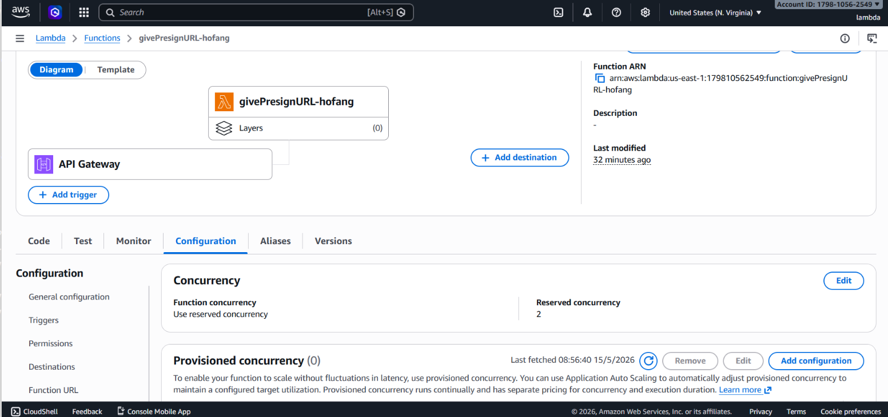

# G3_Lambda_XB-DN26-139_NguyenVanToan

Express application migrated to run on AWS Lambda with minimal code changes.

## Local run

```bash
npm install
npm start
```

## Live API

`https://bkors24ac1.execute-api.us-east-1.amazonaws.com`

## AWS Lambda screenshot



## Main files

- `app.js`: existing Express app
- `server.js`: local HTTP runner
- `lambda.js`: Lambda adapter entrypoint
- `template.yaml`: Lambda handler reference
- `NOTES.md`: delivery notes
